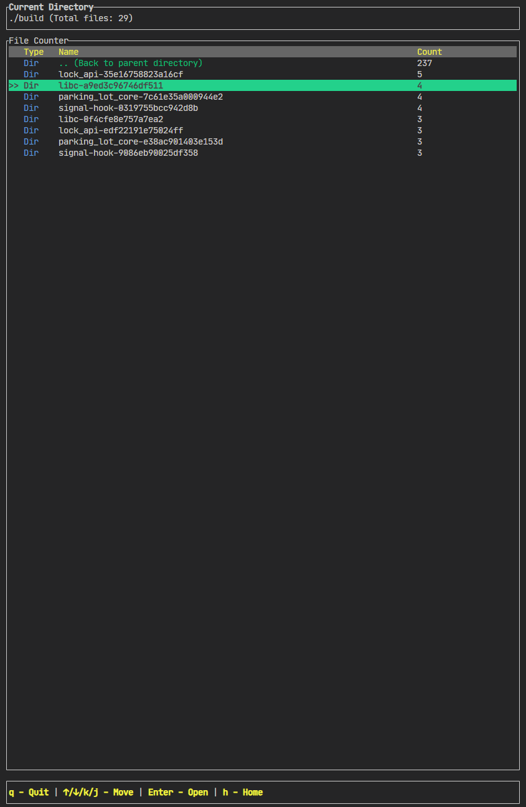

# What's this

This program is a command-line tool used to count the distribution of the number of files under the specified directory.



# Key features

- Acceleration design: including asynchronous statistics, caching, multi-threading, and so on.
- Keyboard directory selection: using the up, down, j, and k keys.
- Mouse directory selection.

# How to use

```bash
chmod +x ./release/file_counter
./release/file_counter /path/to/directory
```

# How to build

```bash
cargo build --release
```

# Others

I don't understand Rust at all. This program was completely implemented relying on o1-preview, and not a single word was written manually. It took three and a half hours.